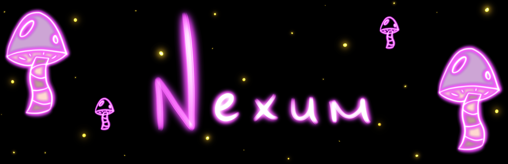
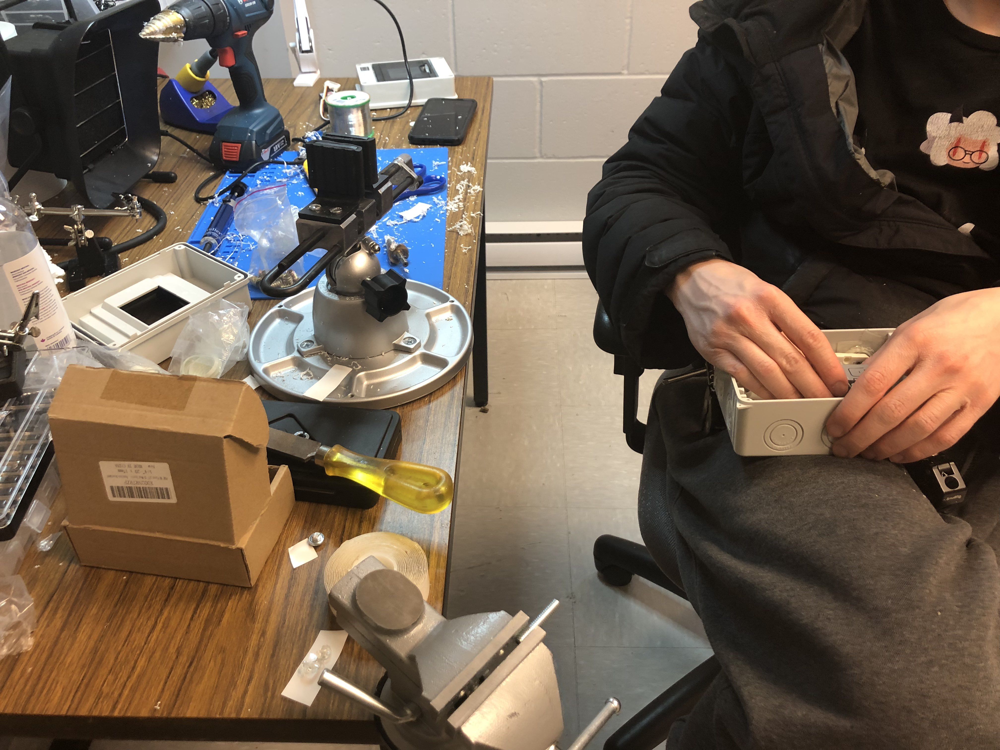
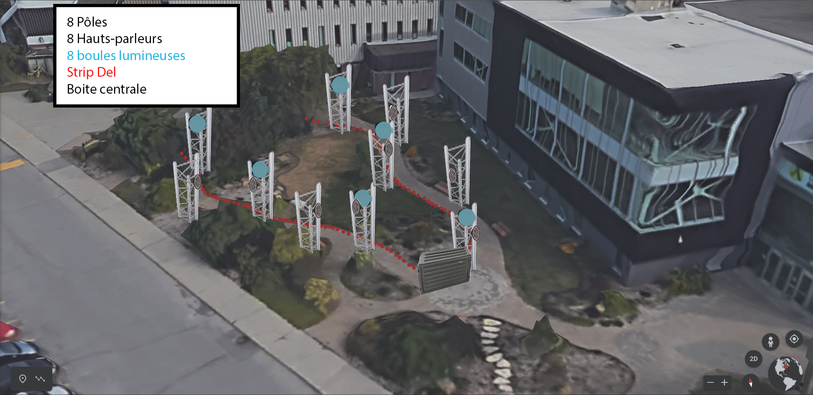

# Nexum

[Source de l'image](https://tim-montmorency.com/2023/projets/Nexum/docs/web/index.html)

## Les créateur(trices) de ce projet 
Sébastien Reilly, Sabrina Laforest, Alexandre Daniel, Maxime Des Lauriers

## Le lien avec le thême Mycélium 
Le lien de ce projet est la nature avec un aspect féerique. 

# L'installation en cours dans le studio 

[Source de l'image](https://tim-montmorency.com/2023/projets/Nexum/docs/web/index.html)

[Source de l'image](https://tim-montmorency.com/2023/projets/Nexum/docs/web/index.html)

[Source de l'image](https://tim-montmorency.com/2023/projets/Nexum/docs/web/index.html)

Les images si dessus représente le travaille des étudiants en 3 ème année dans le Grand studio. Les étudiants sont présentement en train de travailler sur leurs projets afin de régler des problèmes technique et de les mettre au point.

# Le schéma de l'installation prévue 

[Source de l'image](https://tim-montmorency.com/2023/projets/Nexum/docs/web/index.html)

[Source de l'image](https://tim-montmorency.com/2023/projets/Nexum/docs/web/index.html)

Les images si dessus représente le schéma de l'installation prévu pour le projet des étudiants de 3 ème année.
