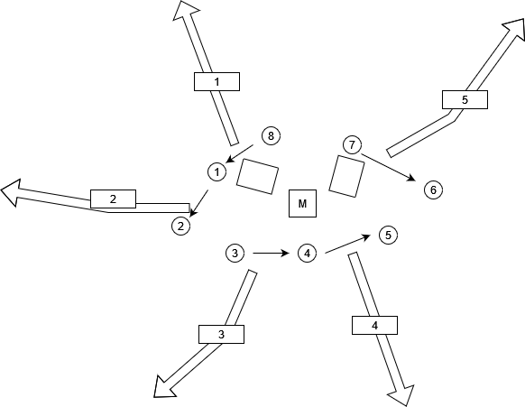

# EDRIA

[Source de l'image](https://tim-montmorency.com/2023/projets/EDRIA/docs/web/index.html)

## Les créateur(rices) de ce projet
Elwin Durand, Loic Delorme, Dominic Roberts, Gabriel Leblanc, Meryem Berbiche, Jean-Christophe

## Le lien avec le thême Mycelium 
Le lien de se projet avec le thême Mycelium est la technologie ainsi que la nature. 

# L'installation en cours dans le studio

[Source de l'image](https://tim-montmorency.com/2023/projets/EDRIA/docs/web/index.html)

[Source de l'image](https://tim-montmorency.com/2023/projets/EDRIA/docs/web/index.html)

[Source de l'image](https://tim-montmorency.com/2023/projets/EDRIA/docs/web/index.html)

[Source de l'image](https://tim-montmorency.com/2023/projets/EDRIA/docs/web/index.html)

# Schéma de l'installation prévue

[Source de l'image](https://tim-montmorency.com/2023/projets/EDRIA/docs/web/index.html)

[Source de l'image](https://tim-montmorency.com/2023/projets/EDRIA/docs/web/index.html)

[Source de l'image](https://tim-montmorency.com/2023/projets/EDRIA/docs/web/index.html)
