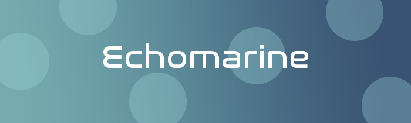

Crédit: Les créatrices du projet 

# Créatrices et leur rôle

### Florence Lapierre - Programmation 
- Création du Site Web
- Aider avec Max patch et Madmapper
- Installation de l'équipement dans l'espace physique

### Natacha Abdallah - Son
- Création des paysages sonores
- Création des bruitages de la faune et de la flore marine
- Intégration des sons dans l'intéractivité
- Aider avec l'installation d'équipements
- Tracy Gua, Maria Laura Coronel. 

### Tracy Gua - Coordination générale et animation
- Création des animaux et des plantes dans illustrator
- Animation des éléments dans After Effects
- Création des spritesheets pour le site web
- Aider avec l'installation d'équipements

### Maria Laura Coronel - Son et programmation
- Création de sons
- Création du Max patch et du projet Madmapper
- Installation de l'équipement dans l'espace physique

# Concept 

### Le lien avec le thême Mycelium 
Le lien de ce projet en lien avec le thême de Mycelium est la nature et les animaux marins.

### L'intention de ce projet
L'intention de ce projet est de nous sensibiliser aux animaux marins en voie de disparition ou en danger.

### Les inspirations
IMAGE ICI 

# Le contenu multimédia 

### Inventaire du matériel nécessaire 
Dans cette installation nous allons retrouver les équipements suivant: 
- 2 paysages sonores
- 6 bruitages d'animaux 
- 1 bruitage d'océan 
- 6 vidéos animation d'arrière plan
- 1 vidéo d'animation d'arrière plan
- 6 spritesheets pour le site web

IMAGE DE L'INSTALLATION 

# Planification techninque
Pour cette installation les créatrices de se projet ont fait une planification technique dont: 
Audio

- 4 hauts-parleur actifs 4" (fourni par le Cegep)
- 1 Carte de son avec 8in et 8out (fourni par le Cegep)

### Vidéo

- 3 projecteurs vidéo (fourni par le Cegep) lentille short throw(ratio 0,5) 3000 lumens
- Drap blanc pour projection
 
### Web

- Tablette tactile
- Ordinateur sur Chariot pour rouler les logiciels (fourni par le cégep)
 
### Électricité

- 8 cordon IEC (pour l'alimentation des haut-parleurs)
- Détection
- Kinect (fourni par le Cegep)
- Rasberry Pi

### Lumière

- Lumière RGB DMX (fourni par le Cegep)
 
### Autre

- Trépied pour tablette
- Affiche
- Ordinateur portable pour l’installation (fourni par le cégep)
- Commutateur Ethernet (Switch)
