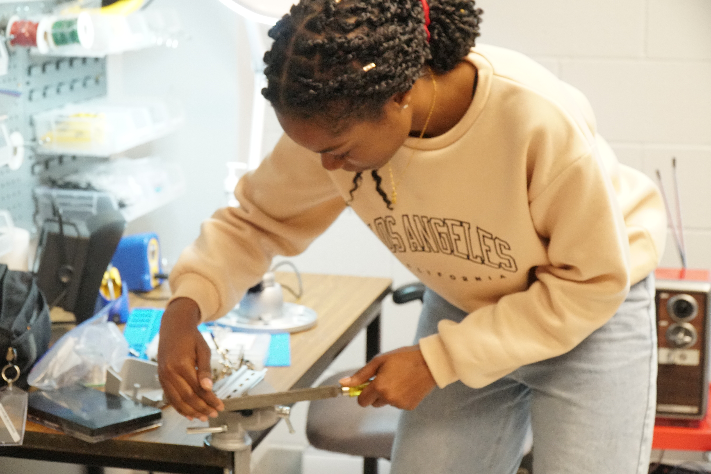
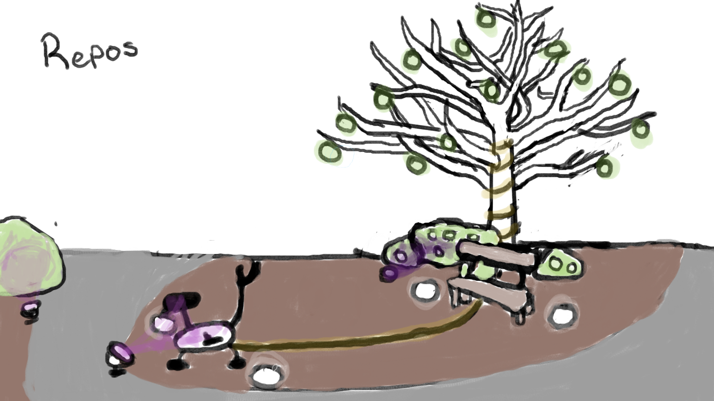

# Luma Sol

[Source de l'image](https://tim-montmorency.com/2023/projets/LumaSol/docs/web/index.html)

### Voici les créateur(trices) de ce projet

ÉloÏse Gagné, Skyla Stimphil, Michaël Simard, Pénélope Morrisson

### Le lien avec le thême Mycélium 
Le thême de ce projet en lien avec le thême Mycélium est l'environnement et la nature. 

# L'installation en cours dans le studios

[Source de l'image](https://tim-montmorency.com/2023/projets/LumaSol/docs/web/index.html)

[Source de l'image](https://tim-montmorency.com/2023/projets/LumaSol/docs/web/index.html)

[Source de l'image](https://tim-montmorency.com/2023/projets/LumaSol/docs/web/index.html)

[Source de l'image](https://tim-montmorency.com/2023/projets/LumaSol/docs/web/index.html)

# Le schéma de l'installation prévue

[Source de l'image](https://tim-montmorency.com/2023/projets/LumaSol/docs/web/index.html)

[Source de l'image](https://tim-montmorency.com/2023/projets/LumaSol/docs/web/index.html)
