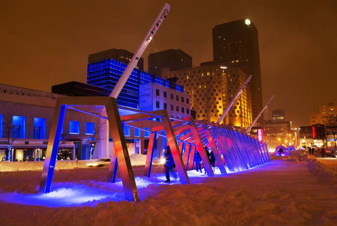
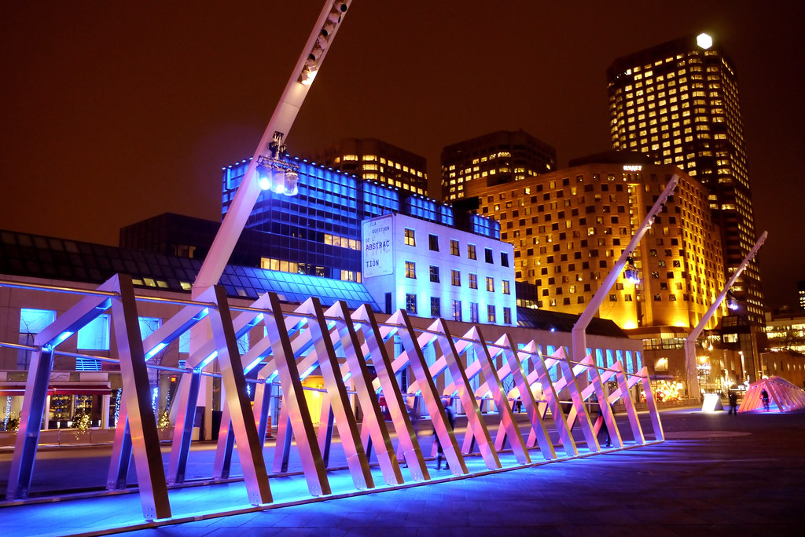
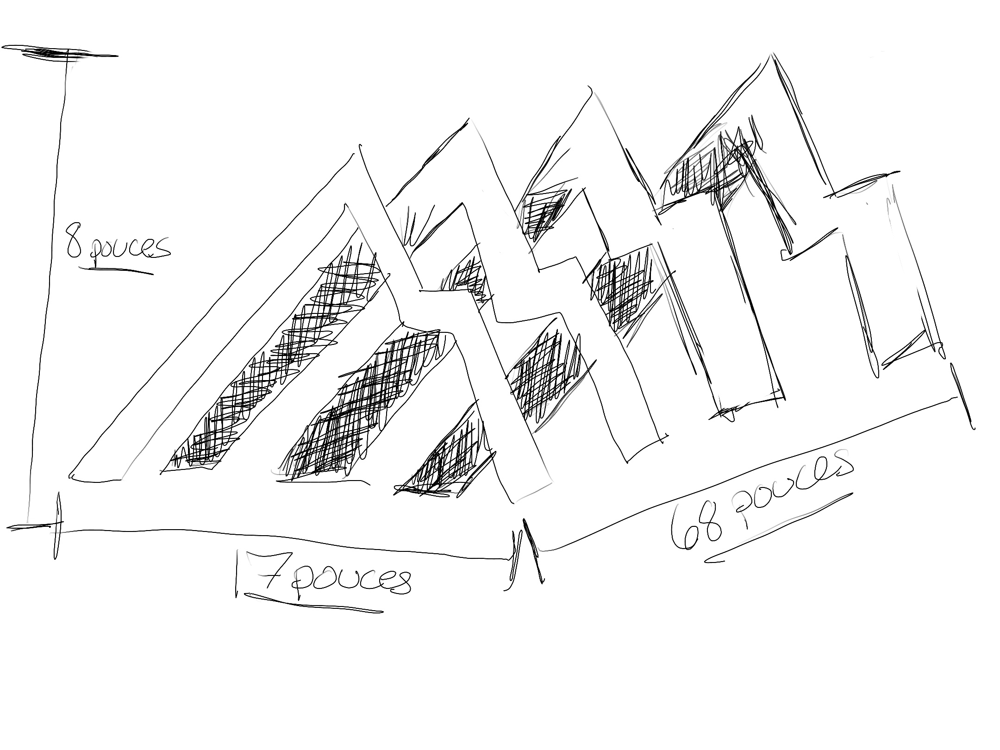
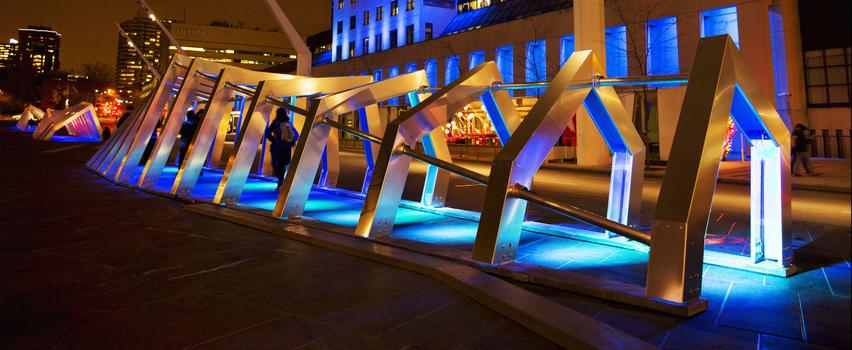
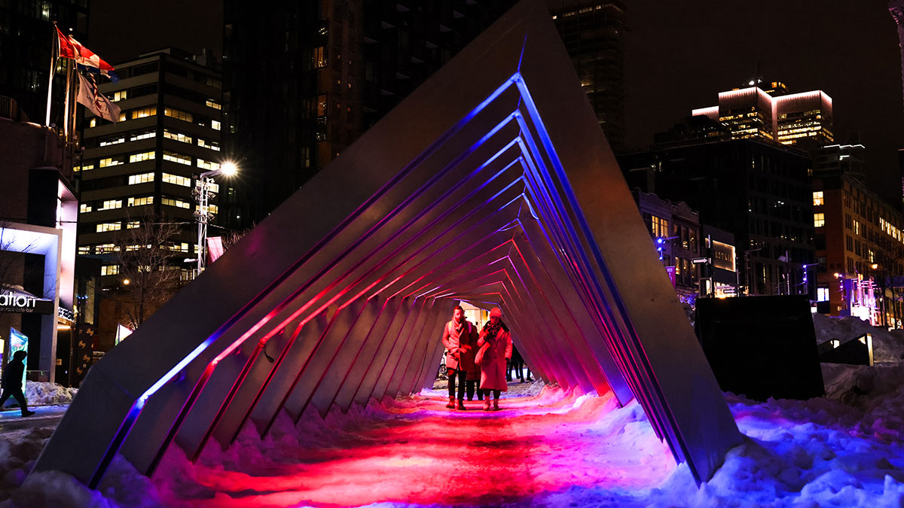

# Luminothérapie - Iceberg

[Photo](https://www.quartierdesspectacles.com/fr/a-propos/les-productions-du-partenariat/oeuvre/20/iceberg-par-appareil-architecture/#): Martine Doyon

## Lieu mise en exposition

Rue Ste-Catherine. 150 Sainte-Catherine O, Montréal, QC Métro : Place-des-Arts.

## Type d'exposition
C'est une installation temporaire qui revient à chaque année pour les festivités d'hiver uniquement.

## Date de ma visiste
Le 4 mars 2023

## Titre de l'oeuvre ou du dispositif
Iceberg

[Source de l'image](https://www.google.com/url?sa=i&url=https%3A%2F%2Fwww.flickr.com%2Fphotos%2Fart_inthecity%2F8254301446&psig=AOvVaw0cPGojC3cZE2UqmBj0FxEh&ust=1682814981218000&source=images&cd=vfe&ved=0CA4QjRxqGAoTCKDR5rzszf4CFQAAAAAdAAAAABC6Ag)

## Nom de l'artiste ou de la firme 
- Direction artistique, conception lumière et réalisation : Félix Dagenais et Louis-Xavier Gagnon-Lebrun 
- Conception architecturale : APPAREIL architecture
- Conception sonore : Jean-Sébastien Côté 
- Conception des modules interactifs : Philippe Jean

## Année de réalisation
L'installation à eu sa première apparence en 2010. 
 
## Description de l'oeuvre ou du dispositif
«Monuments de glace millénaires que le temps et les éléments ont façonnés, les icebergs émettent des sons particuliers. L’eau qui s’infiltre à l’intérieur des crevasses et des fissures les fait résonner comme de gigantesques tuyaux d’orgue dont les tonalités se modulent et se transforment tout au long de leur fonte. À l’image de cet instrument de musique monumental, Iceberg se compose d’une série d’arches métalliques lumineuses qui diffusent des sons particuliers. Organisées en tunnel, ces arches vous invitent à vous y engouffrer pour écouter l’orgue géant et même en jouer.

Les notes et la lumière produites voyagent d’un bout à l’autre de ce corridor musical. D’une ambiance sonore et d’une lumière qui évoquent la pureté boréale, Iceberg se transforme en votre présence. L’activité humaine « réchauffe » ces monuments de glace — véritables baromètres du climat mondial — et transforme leur nature originelle en une symphonie visuelle et sonore. Allez-y, essayez-le !»

[Article](https://www.quartierdesspectacles.com/fr/a-propos/les-productions-du-partenariat/oeuvre/20/iceberg-par-appareil-architecture/#)

## Type d'installation 
C'est une installation interactive.

## Fonction du dispositif multimédia
Le fonctionnment du dispositf est de démontrer le parcours d'un Iceberg du nord vers le sud de la banquise jusqu'à la fonte complète près de la terre ferme en le représentant avec des ambiances sonores différentes. Losrque les visiteurs marche dans le parcours les lumières ainsi que l'ambiance sonore se différencie selon l'étape de la fonte de la banquise.

[Vidéo explicative](https://youtu.be/evwQKQMVA3w)

## Mise en espace 

Le dispositif est située à l'extérieur

## Composantes et techniques

[Source de l'image](https://s3.ca-central-1.amazonaws.com/files.quartierdesspectacles.com/les-prod-du-pqds/installations/iceberg/iceberg-credit-martine-doyon-3706-852x350.jpg)

Pour les composantes techniques ils ont utilisées des caches-fil en métal pour ne pas distraire l'attention vers les fils et aussi pour les protéger de la neige.

## Éléments nécessaires a la mise en exposition

## Expérience vécue

[Source de l'image](https://www.google.com/url?sa=i&url=https%3A%2F%2Fwww.montrealenlumiere.com%2FProgrammation%2FActivite%2FMEL-9510&psig=AOvVaw24YjMcnPokEoKInJ6YIAR_&ust=1682815664953000&source=images&cd=vfe&ved=0CA4QjRxqFwoTCLDt5oHvzf4CFQAAAAAdAAAAABAD)

Les visiteurs sont simplement attendu à marcher dans l'exposition Iceberg du côter qu'il désire pour vivre une expérience hors du commun et coloré. Les visiteurs n'ont aucune interactiviter à faire avec l'oeuvre a pars marcher. 

## Ce qui ma plu 
J'ai beaucoup apprécié l'expérience, mais se que je trouve vraiment intéressant ses la façon dont ils on interpréter la fonte d'une banquise avec de la lumière et des ambiances sonores différentes pour démontrer les étapes de la fonte de la banquise.

## Aspect que vous ne souhaiteriez pas retenir pour vos propres créations ou que vous feriez autrement
Le seule petit B mole serait la neige, car avec l'accumulation de la neige nous avions peur de se cogner la tête sur l'Iceberg donc selon moi pour un projet futur je m'assurais de bien déneiger l'espace pour avoir une meilleure expérience.

## Références
